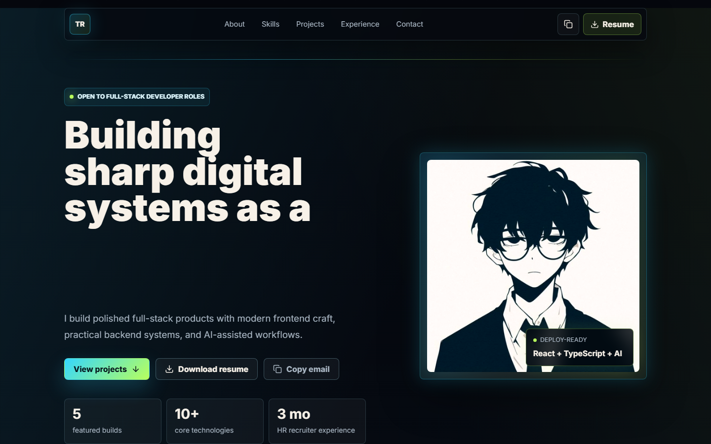
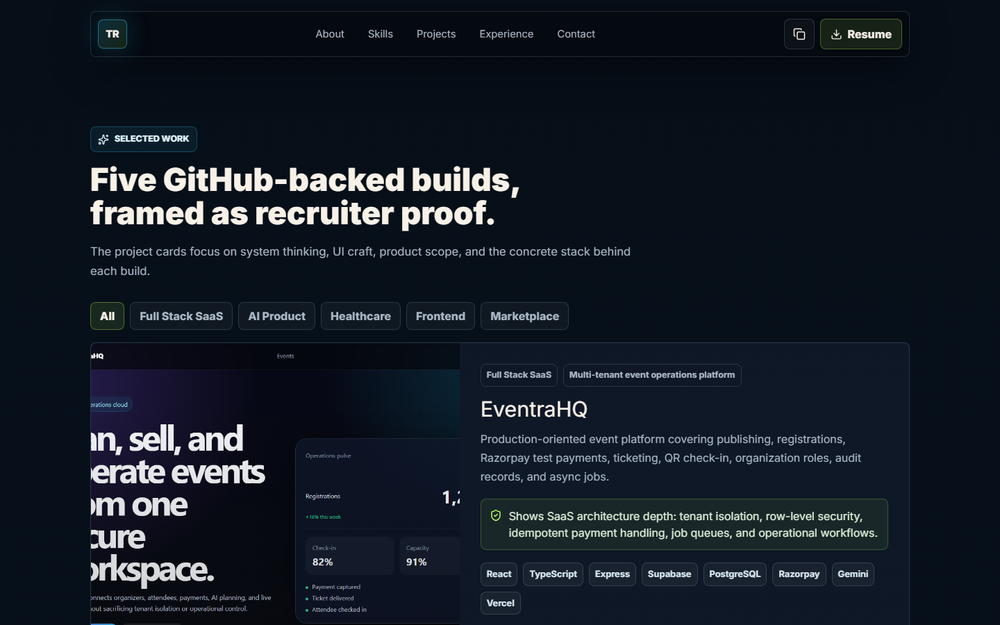
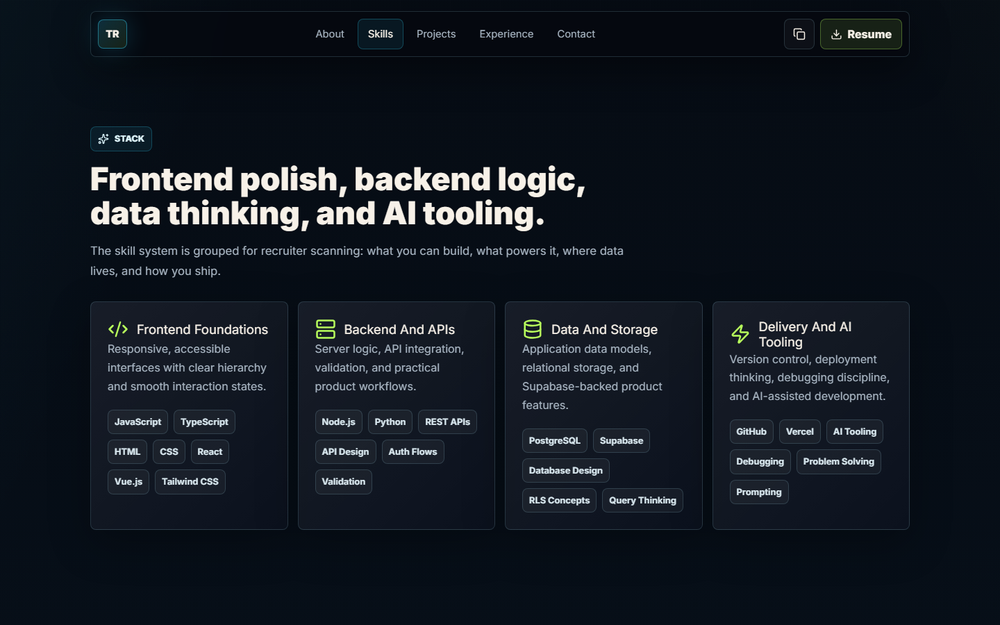
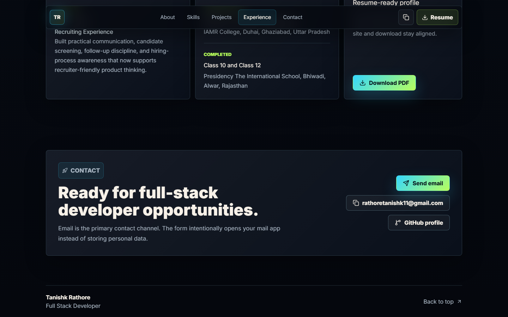
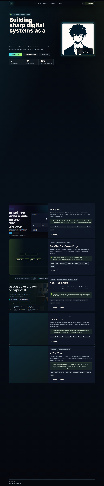

# Tanishk Rathore — Full Stack Developer Portfolio

<div align="center">

[](https://tanishk-rathore-portfolio.vercel.app)
[](https://nextjs.org)
[](https://www.typescriptlang.org)
[](https://react.dev)
[](https://tailwindcss.com)

</div>

<br>

> A premium, recruiter-focused portfolio engineered with cinematic visual identity, fluid motion, and meticulous attention to accessibility. Built to demonstrate full-stack competency while delivering an unforgettable first impression.

<br>

<p align="center">
  
</p>

---

## Table of Contents

- [Vision & Philosophy](#vision--philosophy)
- [Live Preview](#live-preview)
- [What Sets This Apart](#what-sets-this-apart)
- [Feature Showcase](#feature-showcase)
- [Technology Stack](#technology-stack)
- [Getting Started](#getting-started)
- [Project Architecture](#project-architecture)
- [Screenshots](#screenshots)
- [Accessibility & Performance](#accessibility--performance)
- [Resume Generation](#resume-generation)
- [Contact](#contact)

---

## Vision & Philosophy

This portfolio was conceived as more than a digital résumé. It is a **proof of craft** — a living document that demonstrates not only what I can build, but *how* I think about building it.

Every decision, from the color palette to the animation easing curves, from the component composition to the static export strategy, was made with two audiences in mind:

1. **Recruiters & Hiring Managers** — who need to scan quickly, see proof, and understand scope
2. **Fellow Engineers** — who appreciate the nuance of clean architecture, type safety, and performance discipline

The design language draws from a dark, cinematic aesthetic with disciplined glow effects, cyber-inspired accents, and generous whitespace. The result is a portfolio that feels premium without being overwhelming, and technical without being cold.

---

## Live Preview

🔗 **[View Live Portfolio →](https://tanishk-rathore-portfolio.vercel.app)**

---

## What Sets This Apart

| Dimension | Approach |
|-----------|----------|
| **Design System** | Custom CSS variables with a cohesive dark palette, not a cookie-cutter template |
| **Motion** | `motion/react` (Framer Motion) with `useReducedMotion` for inclusive, graceful animations |
| **Accessibility** | Semantic HTML, `aria-label`, `aria-live`, focus-visible outlines, keyboard navigation |
| **Performance** | Static export (`output: "export"`), pre-optimized images, zero runtime JavaScript bloat |
| **Type Safety** | Strict TypeScript with zero `any` types — full IntelliSense across the codebase |
| **SEO** | Dynamic `sitemap.xml`, `robots.txt`, OpenGraph & Twitter meta tags, semantic headings |
| **Resume Sync** | Auto-generated PDF résumé from the same data source as the site — always in sync |

---

## Feature Showcase

### Hero Section

- Animated headline rotator cycling through 5 professional identities (Full Stack Developer, AI Product Builder, React + TypeScript, Supabase Systems, Recruiter-Ready Interfaces)
- Live status indicator with a pulsing dot — "Open to full-stack developer roles"
- Three clear call-to-action pathways: View Projects, Download Resume, Copy Email
- Stat cards showcasing featured builds, core technologies, and recruiter experience
- Floating terminal card with tech stack badge

### About Section

- Three-column card grid with hover-responsive glassmorphism panels
- Personal introduction, geographic context, and design philosophy
- Large-card treatment for the primary bio with iconography

### Skills Grid

- Four quadrant skill system grouped by recruiter-relevant domains:
  - Frontend Foundations (React, TypeScript, Tailwind, Vue)
  - Backend & APIs (Node.js, Python, REST, Auth)
  - Data & Storage (PostgreSQL, Supabase, Database Design)
  - Delivery & AI Tooling (GitHub, Vercel, AI Workflows)
- Tag-based skill display with subtle border treatments

### Projects Portfolio

- Five featured builds with project filtering by category (All, AI Product, Full Stack SaaS, Healthcare, Frontend, Marketplace)
- Each project features:
  - A screenshot or tech-schematic fallback for projects without imagery
  - Category & label badges for quick scanning
  - Impact statement highlighting the engineering value proposition
  - Tech stack chips with individual styling
  - GitHub + Live demo links with external-link indicators
- Animated layout transitions when filtering between categories
- Color-coded accent borders (cyan, lime, coral, gold, violet) for visual differentiation

### Experience & Education Timeline

- Dual-column timeline panel with period badges, role titles, and organization details
- Resume download panel with a prominent CTA button
- Visual hierarchy through section icons and accent colors

### Contact Section

- Pre-composed `mailto:` link with subject and body for instant outreach
- One-click email copy with clipboard feedback (with graceful fallback to `mailto:`)
- Direct GitHub profile link

### Footer

- Clean branding with name and role
- Back-to-top navigation with smooth scroll behavior

---

## Technology Stack

| Layer | Technologies |
|-------|-------------|
| **Framework** | [Next.js](https://nextjs.org) 16 (App Router, Static Export) |
| **Language** | [TypeScript](https://www.typescriptlang.org) 6 (Strict Mode) |
| **UI Library** | [React](https://react.dev) 19 |
| **Styling** | [Tailwind CSS](https://tailwindcss.com) 4 + Custom CSS Variables |
| **Animation** | [motion](https://motion.dev) (Framer Motion successor) |
| **Icons** | [Lucide React](https://lucide.dev) |
| **Font** | [Inter](https://fonts.google.com/specimen/Inter) (Google Fonts, `display: swap`) |
| **Build** | Turbopack (Next.js built-in bundler) |
| **Linting** | ESLint 9 + `eslint-config-next` |
| **PDF Generation** | Custom PDF generation script (no external PDF library dependency) |
| **Image Optimization** | Sharp (asset preparation pipeline) |
| **Deployment** | [Vercel](https://vercel.com) |

---

## Getting Started

### Prerequisites

- [Node.js](https://nodejs.org) 18+ (recommended: 20 LTS or latest)
- [npm](https://npmjs.com) or [pnpm](https://pnpm.io)

### Installation

```bash
# Clone the repository
git clone https://github.com/Tanishk-rathore-01/Portfolio.git
cd Portfolio

# Install dependencies
npm install

# Run the development server
npm run dev
```

The development server will start at [`http://localhost:3000`](http://localhost:3000).

### Build for Production

```bash
# Type-check, lint, and build
npm run validate

# Or build only
npm run build
```

The static output is generated in the `out/` directory, ready for deployment on any static host (Vercel, GitHub Pages, Netlify, Cloudflare Pages, etc.).

### Asset Preparation

```bash
# Prepare avatar from a source image
npm run assets -- <path-to-source-image>

# Generate PDF résumé from profile data
npm run resume
```

---

## Project Architecture

```
Portfolio/
├── docs/                          # Documentation & screenshots
│   └── screenshots/               # README showcase images
│       ├── hero.png
│       ├── fullpage.png
│       ├── projects.png
│       ├── skills.png
│       └── contact.png
├── public/                        # Static assets
│   ├── assets/
│   │   └── avatar.jpg             # Optimized portfolio avatar
│   └── Tanishk_Rathore_Resume.pdf # Auto-generated résumé
├── scripts/                       # Build & utility scripts
│   ├── generate-resume.mjs        # PDF résumé generator (custom PDF engine)
│   ├── prepare-assets.mjs         # Sharp-based image optimization pipeline
│   └── take-screenshots.js        # Playwright screenshot automation
├── src/
│   ├── app/                       # Next.js App Router
│   │   ├── globals.css            # Design system, custom properties, responsive queries
│   │   ├── layout.tsx             # Root layout with Inter font + metadata
│   │   ├── page.tsx               # Homepage (renders PortfolioPage)
│   │   ├── robots.ts              # robots.txt generator
│   │   └── sitemap.ts             # sitemap.xml generator
│   ├── components/
│   │   └── PortfolioPage.tsx      # Single-page application component
│   │                               # Header, Hero, About, Skills, Projects, Experience, Contact, Footer
│   └── data/
│       └── profile.ts             # Centralized content & data source
├── .gitignore
├── eslint.config.mjs              # ESLint 9 flat config
├── next.config.ts                 # Next.js config (static export, image settings)
├── package.json
├── postcss.config.mjs             # Tailwind CSS 4 PostCSS plugin
└── tsconfig.json                  # Strict TypeScript configuration
```

### Design Philosophy

- **Single Source of Truth** — All content lives in `src/data/profile.ts`. Changing one file updates the entire site, the résumé, and the OpenGraph metadata.
- **Component Cohesion** — Each major section is a self-contained function component in `PortfolioPage.tsx`, making the page easy to scan and refactor.
- **CSS Architecture** — Tailwind handles layout utilities; custom CSS handles the bespoke visual system (gradients, glows, glassmorphism, responsive breakpoints) without fighting the framework.
- **Zero Client-Side Bloat** — The site is statically exported. All JavaScript serves a purpose: navigation state, animation, and filtering. No unused frameworks.

---

## Screenshots

### Hero Section

<p align="center">
  
</p>

### Projects Showcase

<p align="center">
  
</p>

### Skills Grid

<p align="center">
  
</p>

### Contact Section

<p align="center">
  
</p>

### Full Page View

<p align="center">
  
</p>

---

## Accessibility & Performance

- **Reduced Motion Respect** — `useReducedMotion` disables all animations for users who prefer reduced motion. Animations fall back to instant state transitions.
- **Keyboard Navigation** — Full keyboard accessibility with visible `:focus-visible` outlines on all interactive elements.
- **Semantic HTML** — Proper `<nav>`, `<main>`, `<section>`, `<article>`, `<footer>` usage with ARIA labels where needed.
- **Screen Reader Support** — Headline rotator uses `aria-hidden` with a static `aria-label` on the parent heading to prevent noise.
- **Color Contrast** — All text meets WCAG AA standards against the dark background. Accent colors are used for decoration, not for critical information.
- **Image Optimization** — `next/image` with `priority` and `sizes` attributes for the hero image; Sharp-based asset pipeline for the avatar.
- **Static Export** — Zero server runtime required. The entire site is a collection of HTML, CSS, and pre-hydrated JS. Perfect for CDN deployment.

---

## Resume Generation

The portfolio includes a lightweight, custom PDF résumé generator (`scripts/generate-resume.mjs`) that produces a clean, single-page PDF from the same data source as the website.

```bash
npm run resume
```

This script generates:
- `public/Tanishk_Rathore_Resume.pdf`

It uses a minimal PDF engine built on raw PDF syntax — no heavy dependencies like `puppeteer` or `pdfkit`. The résumé and the portfolio are always synchronized because they pull from the same `profile.ts` data.

---

## Contact

If you are a recruiter, a hiring manager, or a fellow engineer who would like to collaborate, I'd love to hear from you.

- **Email:** [rathoretanishk11@gmail.com](mailto:rathoretanishk11@gmail.com?subject=Full%20Stack%20Developer%20Opportunity)
- **GitHub:** [@Tanishk-rathore-01](https://github.com/Tanishk-rathore-01)
- **Live Portfolio:** [tanishk-rathore-portfolio.vercel.app](https://tanishk-rathore-portfolio.vercel.app)

---

<div align="center">

Built with intention, precision, and a deep respect for the craft of software engineering.

</div>

